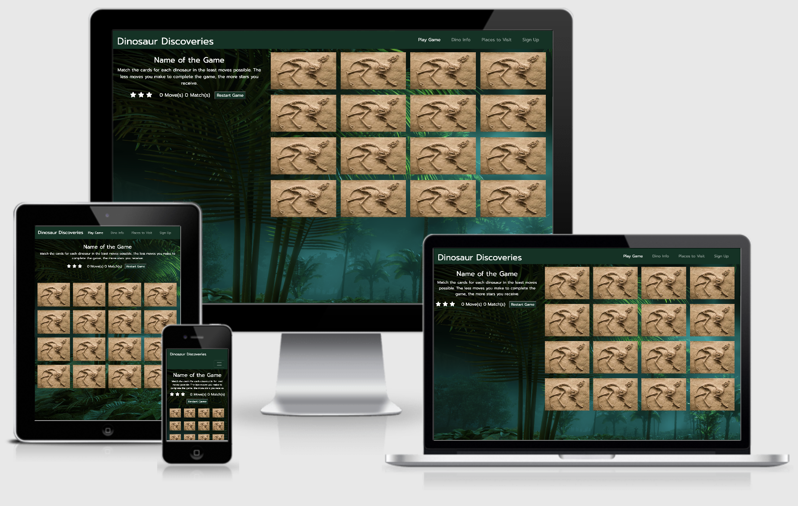

Dinosaur Discoveries - Website
---
## Table of Contents

- [**About**](#About)
- [**UX**](#UX)
  - [Goals](#Goals)
  - [User Stories](#User-Stories)
  - [Styling](#Styling)
  - [Wireframes](#Wireframes)
- [**Features**](#Features)
  - [Existing Features](#Existing-Features)
  - [Features Left To Implement](#Features-Left-To-Implement)
- [**Technologies Used**](#Technologies-Used)
  - [Version Control](#Version-Control)
- [**Testing**](#Testing)
  - [Testing User Stories](#Testing-User-Stories)
  - [Responsive Testing](#Responsive-Testing)
  - [Additional Testing](#Additional-Testing)
  - [Code Validation](#Code-Validation)
- [**Deployment**](#Deployment)
  - [Live Website Link](#Live-App-Link)
  - [Repository Link](#Repository-Link)
  - [Running Code Locally](#Running-Code-Locally)
- [**Credits**](#Credits)
  - [Content](#Content)
  - [Media](#Media)
  - [Acknowledgements](#Acknowledgements)
  
---

## About

The website was created with the younger generation in mind who have a interest in dinosaurs. The aim of the site was to be fun and factual so a game could be played but also information could be found out easily about different dinosaurs.

The mission was for the site to be a one stop information centre for everything dinosaurs.

___

## UX

#### Goals

The goals of the website were:-
1. Display and work on all devices from large screen monitors, Laptops to tablets and phones.
2. Provide an interactive scoring game for dinosaurs that would challenge the users memory.
3. Provide information on dinosaurs based on the pictures in the memory game.
4. Provide a map for information of everywhere to visit locations in the UK that have dinosaurs attractions.
5. Provide a sign up page for a user to receive a monthly newsletter from dinosair discoveries.
6. The website needed to attract the user by using clear images, instructions and sounds.

---

#### User Stories

From the Designers Perspective:-
- The site needs to easy to use and navigate with it being aimed at the youunger generation.
- Thes sites colour screen and background needs to be dinosaur related but easy on the eye.
- The pictures on the site need to be clear so the user can identify the dinosaur type easily.
- The game needs to be easy to understand and play but also be a challenge based on the users memory.
- The selector on the dinosaur information page needs to be easy to use and understand.
- The map needs to be clear and concise and fill the area making it easy for the user to use.
- The sign up form needs to be easy to enter information to attract more people to dinosaur discoveries.
- Dinosaur Discoveries needs to be the goto website for everything dinosaurs.

From the users perspective:-
- I want to find the game a challenge but not too hard.
- I want to learn about different dinosaurs that existed.
- I want to see what the dinosaurs looked like.
- I want to see attractions in the UK where I can find even more about dinosaurs.
- I want to sign up to receive more information from the website.
- I want to the website to make me want to visit and play the game again.

---

### Styling

The website needed to catch the users eye straight away and be dinosaur related, after doing various research on dinosaurs, most were located either on grass land, in water or jungles. I went for a jungle background to create a darker looking theme for the website with clear white writing.

The below colour scheme was used for the menus and text.

---

### Wireframes

---

## Features

### Existing Features

### Features Left To Implement

---

## Technologies Used

- Boostrap 4
  - Bootstrap 4 was used for setting up the sites responsiveness of different size devices using the grid system. It was also used to make the containers fluid and images so they change size automatically depending on the screen size.

- HTML  
  - HTML was used for the main structure of the website.

- JavaScript
  - Javascript was used for all pages to make them more interactive to the user.

- CSS
  - CSS was used to style and change sizes and positions of different items where Bootstrap couldn't be used.

- Google Chrome
  - Google Chrome Inspect and Developer tools was used for examining the website on different devices.

- Google Fonts
  - Google fonts was used for the font of the website.

- Font Awesome
  - Font Awesome was used for the icons for social media - Instagram, Twitter and Linked In.

- VS Code 
  - VS Code was used as the development tool to create all pages. Different add-ons were used in VS Code to aid my developement. These add-ons included were:-
    - Auto Close and Rename Tag - to end tags automatically.
    - Beauty - To help Beautify my coding.
    - Color Highlight - Shows the colours in your coding.
    - CSS Peek - Allows you to show the CSS Next to your HTML Code, rather than going between the two files.
    - Live Server - Allows you to see the live webpage as you code
    - Markdown Preview Enhancer - Allows you to see your markdown file as you type.
    - Prettier - Allows you to Beautify your CSS.

- Pencil
  - This allowed me to create my wireframes for the design of the website.

### Version Control

- VS Code
  - VS Code linked to the repositry in Github was used to do regular Commits from my changes and additions to the website.

- Github
  - Github was used to store the repositry online. All Adds/Commits go to this file online. 

---

## Testing

### Testing User Stories

| Test  |  Result | Extra Coding Required  |
|---|---|---|

### Responsive Testing

To check how the website runned on different devices I used Am-I-Responsive and Inspect in Google Chrome Developer Tools. While doing these tests I did the following:-

|  Test | Result  |  Extra Coding Required |
|---|---|---|

### Additional Testing

 ### Code Validation

 ---

## Deployment

### Live Website Link

 
The website link was created by doing the following steps.

 1. Click on Settings which is located at the top of the page.
 2. Scroll down to the GitHub pages.
 3. Click the dropdown menu under source and select the Master Branch as the source
 4. Scroll through the page to find the site link.

### Repository Link

### Running Code Locally

To run this website and code on your local device, follow the below steps.

1. Go to repository Dinosaurs-MS2 on github.
2. Click Clone or Download.
3. Download the Zip File.
4. Unzip the downloaded zip file on the local device.
5. Run the index.html file via your web browser.

---

## Credits

### Content

All Code was written by myself, I used the following to help my coding.

### Media

### Acknowledgements

