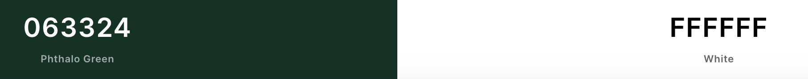

Dinosaur Discoveries - Website
---
## Table of Contents

- [**About**](#About)
- [**UX**](#UX)
  - [Goals](#Goals)
  - [User Stories](#User-Stories)
  - [Styling](#Styling)
  - [Wireframes](#Wireframes)
- [**Features**](#Features)
  - [Existing Features](#Existing-Features)
  - [Features Left To Implement](#Features-Left-To-Implement)
- [**Technologies Used**](#Technologies-Used)
  - [Version Control](#Version-Control)
- [**Testing**](#Testing)
  - [Testing User Stories](#Testing-User-Stories)
  - [Responsive Testing](#Responsive-Testing)
  - [Additional Testing](#Additional-Testing)
  - [Code Validation](#Code-Validation)
- [**Deployment**](#Deployment)
  - [Live Website Link](#Live-App-Link)
  - [Repository Link](#Repository-Link)
  - [Running Code Locally](#Running-Code-Locally)
- [**Credits**](#Credits)
  - [Content](#Content)
  - [Media](#Media)
  - [Acknowledgements](#Acknowledgements)
  
---

## About

The website was created with the younger generation in mind who have a interest in dinosaurs. The aim of the site was to be fun and factual so a game could be played but also information could be found out easily about different dinosaurs.

The mission was for the site to be a one stop information centre for everything dinosaurs.

___

## UX

#### Goals

The goals of the website were:-
1. Display and work on all devices from large screen monitors, Laptops to tablets and phones.
2. Provide an interactive scoring game for dinosaurs that would challenge the users memory.
3. Provide information on dinosaurs based on the pictures in the memory game.
4. Provide a map for information of everywhere to visit locations in the UK that have dinosaurs attractions.
5. Provide a sign up page for a user to receive a monthly newsletter from dinosair discoveries.
6. The website needed to attract the user by using clear images, instructions and sounds.

---

#### User Stories

From the Designers Perspective:-
- The site needs to easy to use and navigate with it being aimed at the youunger generation.
- Thes sites colour screen and background needs to be dinosaur related but easy on the eye.
- The pictures on the site need to be clear so the user can identify the dinosaur type easily.
- The game needs to be easy to understand and play but also be a challenge based on the users memory.
- The selector on the dinosaur information page needs to be easy to use and understand.
- The map needs to be clear and concise and fill the area making it easy for the user to use.
- The sign up form needs to be easy to enter information to attract more people to dinosaur discoveries.
- Dinosaur Discoveries needs to be the goto website for everything dinosaurs.

From the users perspective:-
- I want to find the game a challenge but not too hard.
- I want to learn about different dinosaurs that existed.
- I want to see what the dinosaurs looked like.
- I want to see attractions in the UK where I can find even more about dinosaurs.
- I want to sign up to receive more information from the website.
- I want to the website to make me want to visit and play the game again.

---

### Styling

The website needed to catch the users eye straight away and be dinosaur related, after doing various research on dinosaurs, most were located either on grass land, in water or jungles. I went for a jungle background to create a darker looking theme for the website with clear white writing.

The below colour scheme was used for the menus and text.

The font chosed was prompt because it was clear and concise. The backup font if google fonts didnt load is Sans-Serif.

The background image used for the site was a jungle background to keep with the dinosaur theme.

---

### Wireframes

Play Game - index.html - Browser - [MainBrowserHome](Documentation/Wireframes/mainpagegame-index.html.pdf)
Play Game - index.html - Tablet - [TabletHome](Documentation/Wireframes/tablet-mainpagegame-index.html.pdf)
Play Game - index.html - Mobile - [MobileHome](Documentation/Wireframes/mobile-mainpagegame-index.html.pdf)

Dino Info - dinoinfo.html - Browser - [MainBrowserDinoInfo](Documentation/Wireframes/dinoinfo.html.pdf)
Dino Info - dinoinfo.html - Tablet - [TabletDinoInfo](Documentation/Wireframes/dinoinfo.html-tablet.pdf)
Dino Info - dinoinfo.html - Mobile - [MobileDinoInfo](Documentation/Wireframes/dinoinfo.html-mobile.pdf)

Places - places.html - Browser - [MainBrowserPlaces](Documentation/Wireframes/places.html.pdf)
Places - places.html - Tablet - [TabletPlaces](Documentation/Wireframes/Tabletplaces.html.pdf)
Places - places.html - Mobile - [MobilePlaces](Documentation/Wireframes/mobile-places.html.pdf)

Sign Up - signup.html - Browser - [MainBrowserSignUp](Documentation/Wireframes/signup.html.pdf)
Sign Up - signup.html - Tablet - [TabletSignUp](Documentation/Wireframes/signup.html.pdf)
Sign Up - signup.html - Mobile - [MobileSignUp](Documentation/Wireframes/signup.html.pdf)

**Design Changes to Wireframes**
1. Background change on all pages, new cleaner background chosen for live site.
2. Star Rating added to index.html 
3. Sign Page Div Background made a RGB Clour green for better effect.

---

## Features

### Existing Features

- The navigation menu is pinned to the top, page links are grey and when hovered or the chosen page is live, these are coloured white.
- The game is a 4x4 grid which stays the same grid on all devices from large screen devices to tablets and phones.
- When a card is clicked it spins round to show a dinosaur, the user must remember where the dinosaurs are to match the pair, there is 8 Dinosaurs to match in total.
- The number of moves and matches are counted as the user turns and matches the cards.
- The star rating also updates depending on the number of moves the user takes to complete the game. 14 or less is 3 stars, 15 > 22 is two stars and more than 22 is one star.
- Sounds are played on the turn of a card and a dinosaur roar sound is made when two cards are matched.
- When all cards are matched music is played and the congratulations popup is shown to show the user how many moves and the final star rating.
- The restart button is on the page in case the user has taken more moves than they would like and they want to start again.
- The footer is pinned to the bottom of all pages. 
- The dino info page uses a dropdown selector so the user can select the dinosaur.
- The picture changes and 5 facts are shown for each dinosaur.
- All pictures for the dinosaurs match the pictures that are in the game.
- The places to visit page shows a google map with all places that are of interest to dinosaurs in the uk.
- When the user clicks on the marker it shows the name of the place.
- The sign up page is simple contact form that allows the user to sign up for the monthly newsletter by Dinosaur Discoveries.
- The signup page is linked the Email.JS to notify the website owner of interest on the website.
- When the user clicks sign up, music is played and the button changes colour to notify the user signup is completed.
- If signup is not successful then a error message will be shown.

### Features Left To Implement

- A menu to be added for Easy, Medium and Hard, this would allow to extend the grid to more cards and more dinosaurs depending on the level selected.
- Individual sounds added for each dinosaur on match. 
- Sounds added to the dino info page for each dinosaur to make the page even more interactive.
- More information and website links added to the markers on the map page to allow the user to go straight to the website for each attraction.

---

## Technologies Used

- Boostrap 4
  - Bootstrap 4 was used for the dino info page to create rows and margins.

- HTML  
  - HTML was used for the main structure of the website.

- JavaScript
  - Javascript was used for all pages to make them more interactive to the user.

- CSS
  - CSS was used to style and change sizes and positions of different items where Bootstrap couldn't be used.

- Google Chrome
  - Google Chrome Inspect and Developer tools was used for examining the website on different devices.

- Google Fonts
  - Google fonts was used for the font of the website.

- Font Awesome
  - Font Awesome was used for the icons for social media - Instagram, Twitter and Linked In.

- VS Code 
  - VS Code was used as the development tool to create all pages. Different add-ons were used in VS Code to aid my developement. These add-ons included were:-
    - Auto Close and Rename Tag - to end tags automatically.
    - Beauty - To help Beautify my coding.
    - Color Highlight - Shows the colours in your coding.
    - CSS Peek - Allows you to show the CSS Next to your HTML Code, rather than going between the two files.
    - Live Server - Allows you to see the live webpage as you code
    - Markdown Preview Enhancer - Allows you to see your markdown file as you type.
    - Prettier - Allows you to Beautify your CSS.

- Pencil
  - This allowed me to create my wireframes for the design of the website.

### Version Control

- VS Code
  - VS Code linked to the repositry in Github was used to do regular Commits from my changes and additions to the website.

- Github
  - Github was used to store the repositry online. All Adds/Commits go to this file online. 

---

## Testing

### Testing User Stories

| Test  |  Result | Extra Coding Required  |
|---|---|---|
|The site needs to easy to use and navigate with it being aimed at the younger generation|Testing navigating through pages, making the game easy to understand and play | Extra coding added to show number of matches along with moves|
|Thes sites colour screen and background needs to be dinosaur related but easy on the eye| Clear background added to the site and green colour sheme to match| Picture changed mid project to a more crisp background jungle image|
|The pictures on the site need to be clear so the user can identify the dinosaur type easily| Images made clear as they can in the game to fit the screen, bigger pictures added to the dinfo info page to show more detail, Tested the pictures on various devices| N/A|
|The game needs to be easy to understand and play but also be a challenge based on the users memory|Tested how the instructions showed on all devices and easy to see the cards on all devices, tested by pushing out toe github and testing on my iphone, ipad and macbook and also tested using inspect on google chrome on different devices | N/A|
|The selector on the dinosaur information page needs to be easy to use and understand| Tested the dropdown menu on all devices to make sure it showed ok| Added extra margins so it was showed at the top of page over the picture and facts.|
|The map needs to be clear and concise and fill the area making it easy for the user to use| Tested the map to make sure it showed clear on all devices and was easy to read the markers|N/A |
|The sign up form needs to be easy to enter information to attract more people to dinosaur discoveries| Tested the form entry on all devices and e-mails being received to the test account from E-mail JS| added less margin on mobile and tablet devices to the sign up form filled the device screen more|
|Dinosaur Discoveries needs to be the goto website for everything dinosaurs| Thorough tested the site myself and added the site on the peer-code-review on slack so other users could test| N/A|

### Responsive Testing

To check how the website runned on different devices I usedD Am-I-Responsive and Inspect in Google Chrome Developer Tools. I also pushed out the site regualr to the live area and access the link on my IPhone, Ipad and Macbook. While doing these tests I did the following:-

|  Test | Result  |  Extra Coding Required |
|---|---|---|
|Game instructions and Title and Game board to show properly on different devices so the users doesnt have to scroll down to see the cards when playing| Tested using my opwn Iphone and Ipad and Macbook, also tested using google chrome developer tools, the cards and results were showing too big on mobile| Made the cards div and text for the instructions div smaller in mobile view and stack the two sections on top of each other|
|Pictures to show properly on all views on the dinfo info page| I tested the pictures on various devices to make sure they were showing ok, the picture was showing properly when shrinking down to tablet and mobile view| I changed the dimensions of the picture to accomondate the size of the screen using percentages|
|The facts and picture should be easy to read on all devices | When testing on smaller devices, when shrinking down the text was too small next to the picture | When shrinking down to smaller tablet and phone size, I made col1 stack on top of col2 so it looked better and easier to read on smaller devices|
|The map shpould fill the screen all devices | Tested the map on all devices again | Wrote the map size to a % to show on all screens|
|The button should change colour and music play when the user completes the sign up form | Tested on all devices to make sure it works | N/A |
|The navigation menu should show text on larger screens and tablets and the burger on smaller devices | The text was overlapping when going down to a smaller tablet | Text size changed on media queries for tablets|
|The sign up page should shrink down to fit all sizes|Tested on all devices| Margins changed on smaller devices to make the sign up form fit better|
The footer should be pinned at the bottom of all pages| Tested on all devices and am-i-responsive, when showing on am-i-responsive there was small gap between the footer and the bottom of the page| Margin for above footer changed on large devices|
|The moves, matches and stars should show clear on all device | When viewing on smaller devices there text was overlapping | Made the text smaller and added padding to avoid the text overlap|

### Additional Testing

I also carried the following addtional testing:-
- My son tested the game using my Iphone, Ipad and on a windows laptop on chrome and on safari on macbook, when turning the cards on the iphone and ipad and on safari the card wasn't showing the dinosaur - Webkit was added in the CSS to fix the issue.
- Members of the slack community also tested my website, all results were positive apart from a couple of issues with the sign up form and a scroller which is fixed.

Testing carried out using the console for Javascript:-
- I used console.log on various variables to see how they were updating when the game was being played, the following variables were tested in console.log
1. moves - moves was tested to make sure the number was increasing everytime the user turned over 2 cards.
2. count - count was tested to make sure it increased by one everytime the user matched two cards

### Code Validation

W3C Markup Validation Service and W3C CSS Validation Service was used for validating the code.

 ---

## Deployment

### Live Website Link

https://mattmoore050783.github.io/Dinosaurs-MS2/index.html
 
The website link was created by doing the following steps.

 1. Click on Settings which is located at the top of the page.
 2. Scroll down to the GitHub pages.
 3. Click the dropdown menu under source and select the Master Branch as the source
 4. Scroll through the page to find the site link.

### Repository Link

https://github.com/MattMoore050783/Dinosaurs-MS2

### Running Code Locally

To run this website and code on your local device, follow the below steps.

1. Go to repository Dinosaurs-MS2 on github.
2. Click Clone or Download.
3. Download the Zip File.
4. Unzip the downloaded zip file on the local device.
5. Run the index.html file via your web browser.

---

## Credits

### Content

I used the following links to help moy coding:-
- Code Institue CV project for help with the EMail.JS and Google Map API Connectors and configuration.
- https://www.w3schools.com/default.asp - Used the extra information on Javascript to help with my coding.
- https://stackoverflow.com/  I used this site to source various coding when i was struggling with getting my code to work.
- https://stackoverflow.com/questions/6164507/change-the-content-of-a-div-based-on-selection-from-dropdown-menu - I used this link to help show the information from my dinosaurs when using a dropdown combo box.
- https://www.youtube.com/watch?v=vEROU2XtPR8 - I used this link for extra tuition on javascript.
- https://www.youtube.com/watch?v=ZniVgo8U7ek - I used this site mostly to help with the setup of my board and used the code to setup my game and adopt accordingly.
- https://scotch.io/tutorials/how-to-build-a-memory-matching-game-in-javascript - I used this site to get different coding ideas for the modal congratulations pop up.
- https://www.youtube.com/watch?v=v-RC3kJCL4c - I used these different lessons to give me more information on JQuery.
- https://www.youtube.com/channel/UCHRp19HU7Y2LwfI0Ai6WAGQ - I used this channel for various information on Janascript.
- https://validator.w3.org/#validate_by_uri - I used this site to validate the HTML.
- https://jigsaw.w3.org/css-validator/ - I used this to validate the CSS.
- http://ami.responsivedesign.is/ - I used this to help check the responsive design of my website.
- https://www.favicon-generator.org/ - I used this to generate my favicon.

### Media

All pictures were taken from various sources from google searches for dinosaur backgrounds and the dinosaurs. 

### Acknowledgements

Many Thanks to the below for the help and guidances throughout my project:- 
- My Mentor Maranatha
- Code Institues support team for increasing my hand in date and being supportive while i was working my day to day job through the pandemic.
- The slack community for feedback on my website. 
- Code Institute and the learning programme for Javascript/Jquery/Google Maps API's and EMail.JS

